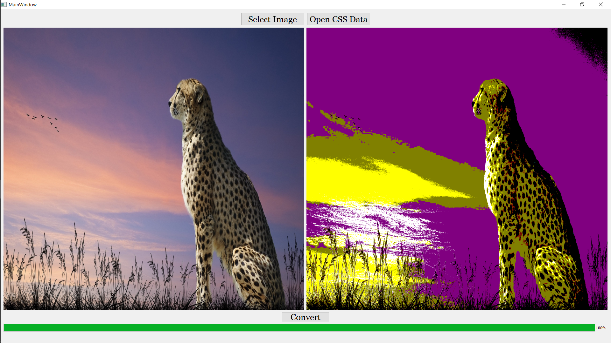
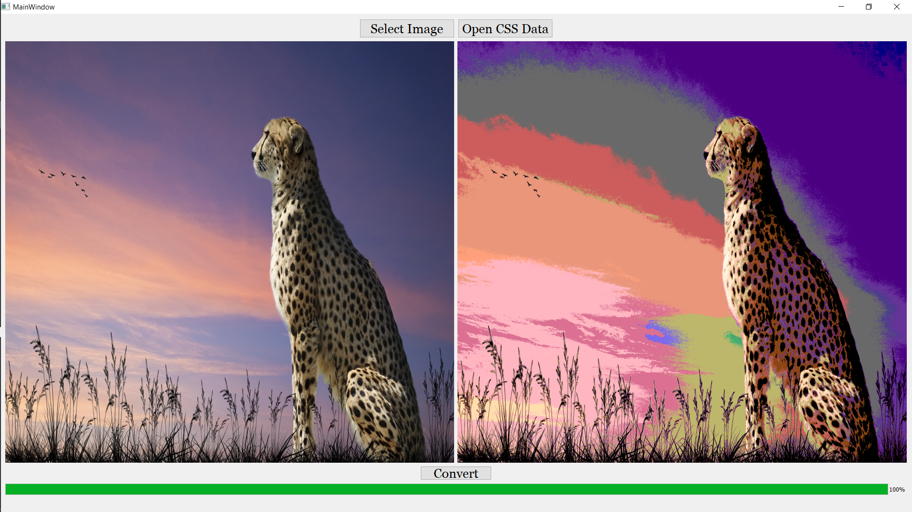

<h2>Using k-d trees to efficiently calculate nearest neighbors in 3D vector space</h2>

<h1>What if we could only use named CSS colors in the images?</h1>

Thinking where this condition occurs !!!!   It does happen when we try to view the images in the TTY terminal where only limited colors are allowed.

<h3>Why I choosed this problem?</h3>

Because this was interesting and different problem for my Advanced Data Structures Package.

We define a color 
C
 to be a 3-dimensional vector 
⎡
⎢
⎣
r
g
b
⎤
⎥
⎦
 with

r
,
g
,
b
∈
Z
 and 
0
≤
r
,
g
,
b
≤
255

To answer our question, we need to take some sort of image and convert every color in the image to one of the named CSS colors. Given a set of colors 
S
 (in this case, 
S
 contains the named CSS colors) and a query color 
C. I would change the query color to the nearest neighbour color in the Set S.

<h3>What would it result in?</h3>
This results in an image with only named colors (or colors in Set S).
Also the size of the image reduces (lossy compression though).

<h2>This image was converted to named CSS set of 16 colors</h2>

<h2>This image was converted to named CSS set of 140 colors</h2>

# <h2>Required Packages

* PyQt5
* PIL

<h5>Please install the packages and to start the application run the RunApplication.py file </h5> 
